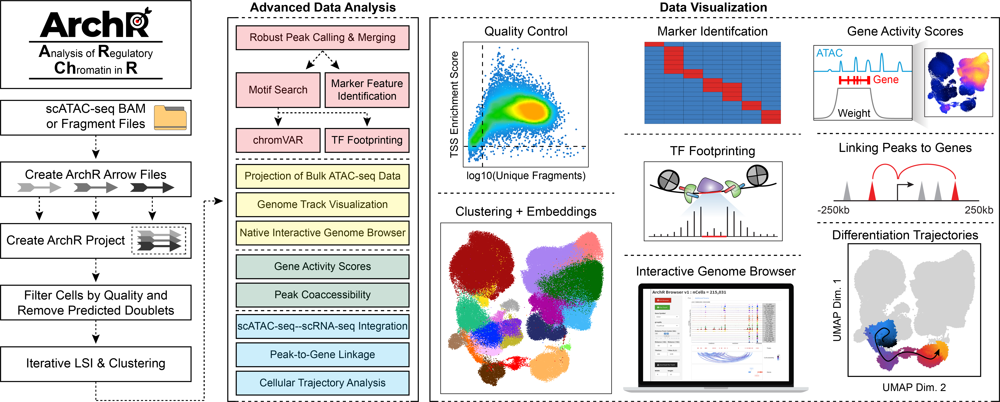

ArchR is a full-featured R package for processing and analyzing single-cell ATAC-seq data. ArchR provides the most extensive suite of scATAC-seq analysis tools of any software available. Additionally, ArchR excels in both speed and resource usage, making it possible to analyze 1 million cells in 8 hours on a MacBook Pro laptop.

### All documentation is available at www.ArchRProject.com.

# Issues using ArchR?
If you find a bug, please report it as an issue on [Github](https://github.com/GreenleafLab/ArchR/issues). If you think the documentation on this website or in the function annotations is unclear, please submit this as an issue on [Github](https://github.com/GreenleafLab/ArchR/issues) with the __documentation__ tag. If you have questions about ArchR usage, please refer to the [the searchable full user's manual](https://www.archrproject.com/bookdown/index.html), [the FAQ section](https://www.archrproject.com/articles/faq.html), and the publication. If none of these options help, [send us an email](mailto:archr.devs@gmail.com). We will do our best to respond to questions that are not otherwise answered in the documentation.

